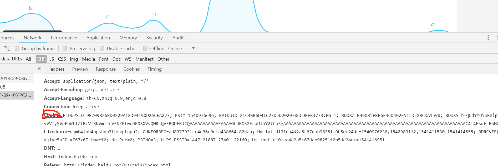

# 介绍
百度指数更新，原有的异步拼图变为了更简单的数字解密

# 使用方法
首先使用浏览器登录百度指数，得到cookie字符串，保存为baidu.cookie文件,

然后执行命令

```
python index.py keyword 2018-10-10 2018-11-04
```
其中keyword是必需的搜索词
后面的是开始和结束日期可选(不传递默认抓取最近一周)，若只传一个默认搜索从过去到现在的热度，例如
```
python index.py keyword 2018-10-10
```
搜索keywrod从2018-10-10至今的热度

# 登录
本代码没有提供登录，使用者可以使用selenium模拟登录，或者其他脚本登录，一般登录需要注意图片验证码(可破)，和手机验证码(尤其是香港或者其他地区的ip登录会经常出现验证码)
简单的方法是保存cookie文件，一周更新一次